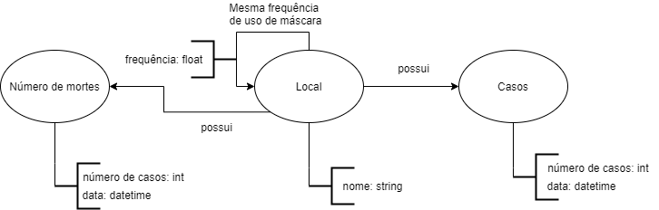

# Modelo para Apresentação do Lab07 - Modelo Lógico para Banco de Dados de Grafos

Estrutura de pastas:

~~~
├── README.md  <- arquivo apresentando a tarefa
│
└── images     <- arquivos de imagem usados na tarefa
~~~

# Aluno
* `188092`: `Vinicius Alves Mancine Dantas`

## Modelo Lógico do Banco de Dados de Grafos
> 

## Perguntas de Pesquisa/análise

> Liste aqui as três perguntas de pesquisa/análise
> * O aumento do número de casos em um local influência o uso de máscaras no mesmo?
> * Os locais com maior número de casos são também os lugares com menor índice de uso de máscaras?
> * Quais são os locais com maior número de casos por indice de uso de máscaras?