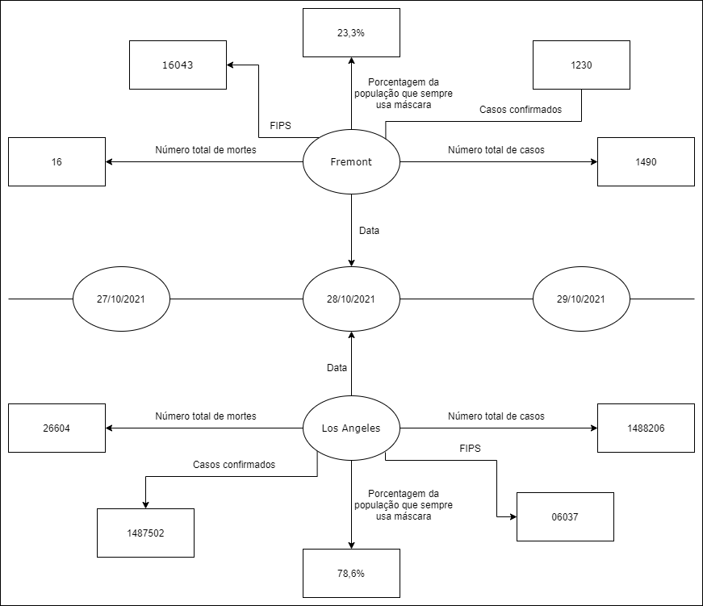

# MC536-lab09
Laboratório 09 - MC536 - Bancos de Dados Teoria e Prática, UNICAMP, 2S2021

# Aluno
* `188092`: `Vinicius Alves Mancine Dantas`

# Grafo de conhecimento do banco de dados

# Perguntas

> Na data de hoje, quais são as dez cidades com maior número de casos? Quantas delas possuem uma porcentagem menor de 50% da população que sempre usa máscara?

> As cidades que possuem as maiores porcentagens da população que sempre usa máscara são também as com menores números de mortos?

> Qual a média da porcentagem da população que sempre usa máscara entre as 50 cidades com maior número de mortes? E entre todas as cidades?